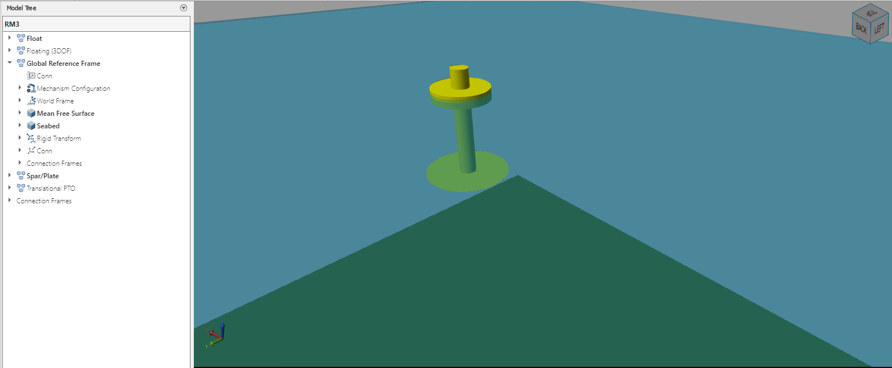
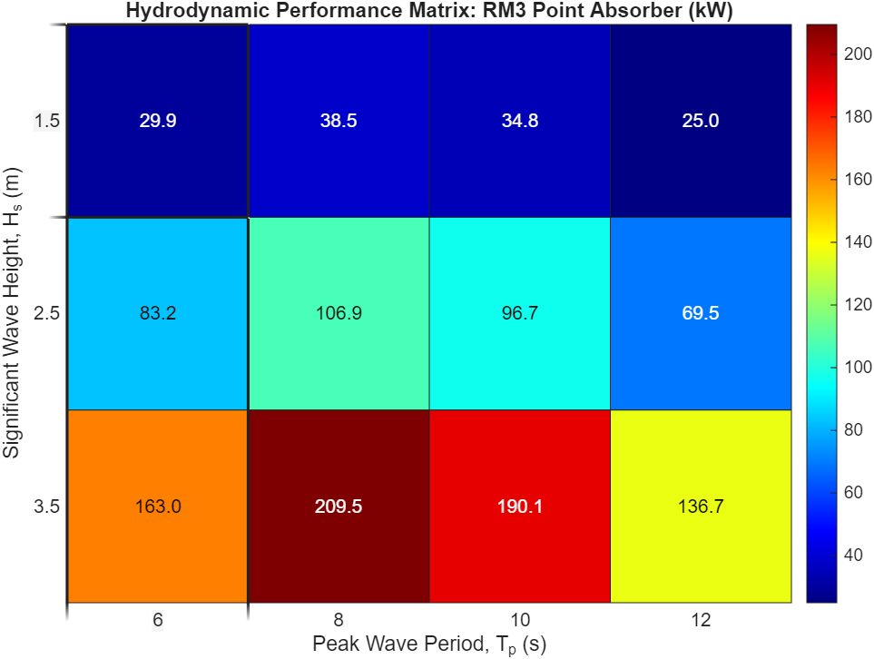

# Performance Assessment of the RM3 Point Absorber across Variable Sea States

<p align="center">

</p>

This project evaluates the power generation capabilities of the **Reference Model 3 (RM3)** wave energy converter. Utilizing the **WEC-Sim** multi-body dynamics solver and the **Cummins Equation**, the device's response was simulated across 12 distinct irregular sea states modeled by the **Pierson-Moskowitz spectrum**. The study successfully mapped the operational boundaries of the device, identifying a peak mean power output of **209.5 kW**.

## 📌 Project Overview

Developing viable wave energy solutions requires a precise understanding of how wave energy conversion device interacts within a typical ocean environment. This is because energy capture varies significantly with the sea state’s energy density profile, a static approach to power modeling cannot accurately predict the performance of the RM3 in diverse sea conditions.

This project solves this by executing a series of time-domain simulations to generate a **Bivariate Performance Matrix**. By analyzing the relative heave motion between the dynamic surface float and the inertially-stabilized spar, the study quantifies energy capture efficiency across various wave heights ($H_s$) and peak periods ($T_p$).

## 🛠️ Technology Used

* **Simulation Environment:** WEC-Sim (Wave Energy Converter SIMulator)
* **Modeling Tool:** MATLAB / Simulink / Simscape Multibody
* **Hydrodynamics:** Boundary Element Method (BEM) data via BEMIO
* **Spectral Modeling:** Pierson-Moskowitz (PM) Sea State Theory
* **Data Processing:** MATLAB (Simulation & Steady-state data extraction)

## 🔳 Key Features

* **Time-Domain Analysis:** Solving the Cummins equation to account for fluid-memory effects and radiation damping.
* **Automated Processing:** A MATLAB script to iterate through 12 unique sea states without manual intervention.
* **Steady-State Filtering:** Implementation of a 100s ramp time and 50% data truncation to ensure results reflect fully developed conditions.

## 📁 Repository Structure

<pre> 
├── geometry
├── hydroData
├── output   
├── results
├── sim_files 
│ ├── plot_Heatmap.m 
│ └── run_PowerMatrix.m  
├── LICENSE 
├── README.md
├── RM3.slx  
├── RM3_simulation.mp4 
├── userDefinedFunctions.m 
├── wecSimInputFile.m  
</pre>


## 🚀 Getting Started

### Prerequisites

* **MATLAB 2022b or newer**
* **Simulink & Simscape Multibody**
* **WEC-Sim Source Code** [Official Github Repository](https://github.com/WEC-Sim/WEC-Sim#)

### 1. Installation

```bash
git clone https://github.com/Oluwatobi-coder/RM3-Point-Absorber-Performance.git
cd RM3-Point-Absorber-Performance

```

### 2. Run Simulation

* Navigate to the project root folder.
* Add the WEC-Sim `source` folder to your MATLAB path.
* Run the following to include the source scripts:

```matlab
addpath(genpath('sim_files'))

```

* Run the simulation script:

```matlab
run('../sim_files/run_PowerMatrix.m')

```

**Note:** To visualize the RM3 3D simulation, set the status of `simu.explorer` to 'on' in the `wecSimInputFile` in the root folder and run the `run_PowerMatrix.m` file again.


## 📊 Results

The simulation revealed that the RM3 reveals a peak power output at a wave height of **3.5 m** and **8-second period** for the tested sea states.

<p align="center">

</p>

## 📚 References

Cummins, W. E. & Armed Services Technical Information Agency. (1962). The Impulse Response Function and Ship Motions. https://apps.dtic.mil/sti/trecms/pdf/AD0288277.pdf

Lawson, M., Yu, Y., Ruehl, K., Michelen, C., & Tom, N. (2016). WEC-SIM Wave Energy Converter Simulator [Dataset]. In OSTI OAI (U.S. Department of Energy Office of Scientific and Technical Information). https://doi.org/10.7799/1887272

Pierson, W. J., & Moskowitz, L. (1964). A proposed spectral form for fully developed wind seas based on the similarity theory of S. A. Kitaigorodskii. Journal of Geophysical Research, 69(24), 5181-5190. https://doi.org/10.1029/JZ069i024p05181


## 📜 License

This project is licensed under the MIT License - see the `LICENSE` file for details.

If you find this RM3 Point Absorber simulation work useful for your offshore renewable energy research, please ⭐ the repository!
